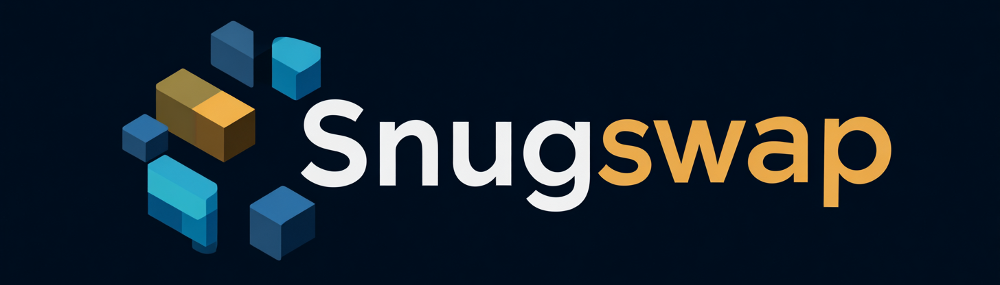

<p align="center">
  
</p>

# SnugSwap


[](https://creativecommons.org/publicdomain/zero/1.0/)
[](https://github.com/danielkrainas/snugswap)


SnugSwap is a helper library for **FFXI Windower GearSwap** that lets you describe your gear setups in a more *declarative* and readable way.

Instead of writing a lot of `if spell.type == ... then equip(sets.foo)` logic, you mostly just:

* Define your **modes** (DD / tank / hybrid / etc)
* Define your **gear sets**
* Attach simple **conditions** (status, spell type, weather, pet out, etc)
* Let SnugSwap handle `precast`, `midcast`, `aftercast`, `status_change`, and pet events for you

## Table of Contents

* [SnugSwap](#snugswap)

  * [Features](#features)
  * [Installation](#installation)

    * [Recommended: Auto-wire all GearSwap callbacks](#recommended-auto-wire-all-gearswap-callbacks)
    * [Alternative: Manual wiring (if you want custom hook logic)](#alternative-manual-wiring-if-you-want-custom-hook-logic)
  * [Quick Start](#quick-start)

    * [1. Define a mode](#1-define-a-mode)
    * [2. Default weapon / idle / engaged sets](#2-default-weapon--idle--engaged-sets)
    * [3. Mode-based gear with `gearset_from_mode`](#3-mode-based-gear-with-gearset_from_mode)
  * [Conditional Gear with `gearset(...)`](#conditional-gear-with-gearset)
  * [Combining Sets](#combining-sets)
  * [Spells, Skills, and Weapon Skills](#spells-skills-and-weapon-skills)

    * [Fast Cast](#fast-cast)
    * [Precast / Midcast / Both](#precast--midcast--both)
    * [Weapon Skills](#weapon-skills)
  * [Modes with Gear Mappings](#modes-with-gear-mappings)
  * [Utility Sets](#utility-sets)

    * [Defining utility sets](#defining-utility-sets)
    * [Using them in-game](#using-them-in-game)
  * [In-Game Commands Summary](#in-game-commands-summary)

    * [Modes](#modes)
    * [Utility sets](#utility-sets-1)
    * [Weapon cycling](#weapon-cycling)
  * [Debugging & Tracing](#debugging--tracing)
  * [Advanced Stuff (Optional)](#advanced-stuff-optional)

    * [Middleware: `snugs:register_middleware`](#middleware-snugsregister_middleware-optional-but-powerful)
    * [Custom predicate extensions with `snugs:extend_predicate`](#custom-predicate-extensions-with-snugsextend_predicate)
    * [Predicates directly: `when()` and `where()`](#predicates-directly-when-and-where)
    * [Selectors: `use`, `choose_from`, and `choose_all`](#selectors-use-choose_from-and-choose_all)
  * [Minimal Example](#minimal-example)
  * [License](#-license)

## Features

* **Simple default sets** for:

  * weapons
  * idle
  * engaged
  * fast cast
  * weapon skills
  * precast / midcast
* **Modes** (e.g. `style = dd / tank / hybrid / magic / layered`) with easy in-game toggles
* **Condition-based sets** using a friendly chain style:

  * only when *Engaged*
  * only when *weather is Light*
  * only when *you have a pet out*
  * only when *HP% < X*, *TP > Y*, etc.
* **Mode-aware gear** via `gearset_from_mode`
* Built-in support for:

  * `gs c toggle <mode>`
  * `gs c set <mode> <value>`
  * `gs c list modes`
  * Utility sets like `warp`, `nexus`, `speed`
  * e.g: `gs c util warp` will equip the warp utility set

---

## Installation

1. Put [`snugswap.lua`](snugswap.lua) in your GearSwap `libs` folder, for example:

   ```text
   Windower/
     addons/
       GearSwap/
         libs/
           snugswap.lua
   ```

2. In your job lua, include SnugSwap at the top:

   ```lua
   include('snugswap')
   ```

3. Wire SnugSwap into GearSwap

SnugSwap can automatically install all standard GearSwap callbacks for you.
This is the easiest and most common setup.

### **Recommended: Auto-wire all GearSwap callbacks**

```lua
include('snugswap.lua')

function get_sets()
    -- define all your sets and modes here using snugs
end

-- Automatically install any missing GearSwap hooks
snugs:wire_all()
```

`wire_all()` will:

* Create `precast`, `midcast`, `aftercast`, `status_change`,
  `self_command`, `pet_change`, `pet_midcast`, `pet_aftercast`
* Wrap your existing `get_sets()` so SnugSwap can initialize modes afterwards
* **Not overwrite** any hook you have already defined

This is typically all you need.

---

### **Alternative: Manual wiring (if you want custom hook logic)**

If you prefer to control the callbacks yourself, you can forward the events to SnugSwap manually:

```lua
function get_sets()
    -- define all your sets here using snugs
end

function precast(spell)         snugs:do_precast(spell)         end
function midcast(spell)         snugs:do_midcast(spell)         end
function aftercast(spell)       snugs:do_aftercast(spell)       end
function status_change(n, o)    snugs:do_status_change(n, o)    end
function self_command(cmd)      snugs:do_self_command(cmd)      end
function pet_change(pet, gain)  snugs:do_pet_change(pet, gain)  end
function pet_midcast(spell)     snugs:do_pet_midcast(spell)     end
function pet_aftercast(spell)   snugs:do_pet_aftercast(spell)   end
```

Use this approach if you want to insert your own logic before or after SnugSwap executes.

---

## Quick Start

### 1. Define a mode

A *mode* is just a named setting you can switch in-game (like “playstyle”):

```lua
snugs:add_mode("style", {
    initial_value = "hybrid",
    description   = "Playstyle",
    cycle_values  = {"dd", "tank", "hybrid", "magic", "layered"},
})
```

In game, you can toggle it with:

```text
//gs c toggle style
//gs c list modes
```

Or set it directly:

```text
//gs c set style tank
```

---

### 2. Default weapon / idle / engaged sets

You can tell SnugSwap what your “default” sets are:

```lua
snugs:default_weaponset({
    main="Naegling",
    sub="Blurred Shield +1",
})

snugs:default_idle({
    -- your idle set here
})

snugs:default_engaged({
    -- your engaged set here
})
```

These are what you’ll fall back to whenever SnugSwap “resets” you after actions or status changes.

---

### 3. Mode-based gear with `gearset_from_mode`

Instead of writing `if style == 'tank' then ...`, you can map mode values to sets:

```lua
snugs:default_weaponset(
    gearset_from_mode("style", {
        dd     = {main="Naegling", sub="Blurred Shield +1"},
        tank   = {main="Nixxer",   sub="Srivatsa"},
        hybrid = {main="Naegling", sub="Srivatsa"},
        magic  = {main="Nixxer",   sub="Aegis"},
        layered= {main="Naegling", sub="Srivatsa"},
    })
)
```

Now when you do:

```text
//gs c toggle style
```

your weapon set automatically changes to match the mode.

You can do the same for idle/engaged:

```lua
snugs:default_idle(
    gearset_from_mode("style", {
        dd     = dd_idle_set,
        tank   = tank_idle_set,
        hybrid = hybrid_idle_set,
        magic  = magic_idle_set,
        layered= layered_idle_set,
    })
)
```

---

## Conditional Gear with `gearset(...)`

The `gearset()` function lets you attach conditions to a set in a readable way.

Example: only use this set while **Engaged**:

```lua
local sird_set = gearset({
    head="Souv. Schaller +1",
    ammo="Staunch Tathlum +1",
    neck="Moonlight Necklace",
    body="Chev. Cuirass +2",
}):when():status("Engaged")
```

More examples:

### Weather / Day / Buff

```lua
local obi_set = gearset({
    waist="Hachirin-no-Obi",
})
:when():weather("Light")
:or_instead( when():day("Light") )
:or_instead( when():buff("Aurorastorm") )
```

### Pet out or not

```lua
local petdt_set = gearset({
    -- pet DT gear
}):when():has_pet(true):otherwise(base_set)
```

### HP / TP / MP conditions

```lua
local low_hp_panic_set = gearset({
    body="Max DT Body",
}):when():hpp_less_than(30)
```

```lua
local high_tp_set = gearset({
    waist="TP Bonus Belt",
}):when():tp_greater_than(2500)
```

You can stack more than one condition by chaining them onto `:when()`:

```lua
gearset(my_set):when()
    :status("Engaged")
    :tp_greater_than(1500)
```

---

## Combining Sets

You’ll often want to start from a base set and override a few slots.

Use `:and_combine(...)` to layer sets:

```lua
local tank_set = { ... }

local magic_tank_set = gearset(tank_set):and_combine(gearset({
    neck="Warder's Charm +1",
}))
```

You can chain multiple:

```lua
gearset(tank_set)
  :and_combine(gearset(extra_enmity))
  :and_combine(gearset(extra_SIRD))
```

For simple raw GearSwap-style combining, you can still use `set_combine`:

```lua
local dd_set = set_combine(base_set, {
    head="Sakpata's Helm",
    -- etc
})
```

SnugSwap fully supports both.

---

## Spells, Skills, and Weapon Skills

SnugSwap has helper methods for precast/midcast/WS sets so you don’t have to write your own `if spell.type ==...` logic.

### Fast Cast

```lua
snugs:default_fastcast({
    head="Carmine Mask +1",
    feet="Carmine Greaves +1",
    left_ring="Prolix Ring",
    left_ear="Loquac. Earring",
})

snugs:fastcast("Enhancing Magic", {
    waist="Siegel Sash",
})
```

* `default_fastcast` = global fast cast set
* `fastcast("Enhancing Magic", ...)` = extra fast cast for that skill/spell

### Precast / Midcast / Both

Define for specific spell names or skill types:

```lua
snugs:precast("Reward", {
    ammo="Pet Food Theta",
})

snugs:midcast("Reward", {
    -- midcast Reward set
})

-- or both at once:
snugs:premidcast("Call Beast", {
    feet="Gleti's Boots",
    hands="Ankusa Gloves +3",
})
```

Apply to **multiple** spells at once:

```lua
local cure_spells = {"Cure", "Cure II", "Cure III", "Cure IV", "Curaga", "Curaga II", "Curaga III"}
snugs:midcast_all(cure_spells,
    gearset(enmity_set)
      :and_combine(cure_set)
      :and_combine(cure_obi_set)
      :and_combine(sird_set)
)
```

Available helpers:

* `snugs:precast(name, set)`
* `snugs:midcast(name, set)`
* `snugs:premidcast(name, set)` (both)
* `snugs:precast_all({names}, set)`
* `snugs:midcast_all({names}, set)`
* `snugs:premidcast_all({names}, set)`

You can also define **skill-based** sets (`"Enhancing Magic"`, `"Divine Magic"`, etc.) that apply to all spells of that skill if no spell-name-specific set is defined.

### Weapon Skills

Set a default WS set:

```lua
snugs:default_weaponskill(base_ws_set)
```

Override per WS:

```lua
snugs:weaponskill("Savage Blade", savage_blade_set)
snugs:weaponskill_all({"Mistral Axe", "Savage Blade"}, some_multi_ws_set)
```

If a WS has no specific set defined, SnugSwap uses `default_weaponskill`.

---

## Modes with Gear Mappings

Modes can also carry their own gear mappings (e.g. jug pet ammo):

```lua
snugs:add_mode("jug", {
    initial_value = "sheep",
    description   = "Current Jug Pet",
    gearset_mappings = {
        sheep    = {ammo="Lyrical Broth"},
        diremite = {ammo="Crackling Broth"},
        slime    = {ammo="Putrescent Broth"},
        -- etc...
    }
})
```

Then you can pull from that mode straight into your sets:

```lua
snugs:premidcast_all({"Call Beast", "Bestial Loyalty"},
    gearset({
        feet="Gleti's Boots",
        hands="Ankusa Gloves +3",
    }):and_combine(gearset_from_mode("jug"))
)
```

Changing your jug mode in game (`//gs c toggle jug`) auto-updates the ammo used.

---

## Utility Sets

You can define general “utility” sets you call via `gs c util` or short commands.

### Defining utility sets

```lua
snugs:util("warp", {
    ring1="Warp Ring",
})

snugs:util("speed", {
    legs="Carmine Cuisses +1",
})
```

### Using them in-game

```text
//gs c util myset (command syntax for any custom utility set)
//gs c warp    (special shortcut)
//gs c speed   (special shortcut)
//gs c nexus   (if you define snugs:util("nexus", {...}))
```

SnugSwap handles equipping these sets for you.

---

## In-Game Commands Summary

All of these go through `self_command` and are handled by SnugSwap.

### Modes

```text
//gs c list modes
//gs c toggle <modeName>
//gs c set <modeName> <value>
```

Examples:

```text
//gs c toggle style
//gs c set style tank
//gs c set debug true
//gs c set trace true
```

### Utility sets

```text
//gs c util <name>
//gs c warp
//gs c nexus
//gs c speed
```

### Weapon cycling

If you defined named weapon sets with `snugs:weaponset("name", set)`, you can cycle them:

```text
//gs c cycle weapon
```

SnugSwap remembers the current weapon set and equips it on status resets.

---

## Debugging & Tracing

If you want to see what SnugSwap is doing:

```text
//gs c set debug true
```

Enables extra debug output (green text).

```text
//gs c set trace true
```

Prints a full breakdown of the **final** gear set that’s being equipped, slot by slot. Very handy when you’re stacking multiple `gearset(...):and_combine(...)` layers and want to see the result.

Turn them off with:

```text
//gs c set debug false
//gs c set trace false
```

---

## Advanced Stuff (Optional)

If you want to go further, SnugSwap also provides some advanced tools:

* **Custom predicates extensions** with `snugs:extend_predicate(...)`.
* **Predicates directly**: `when()`, `where(fn)`, etc. for custom logic.
* **Selectors**: `use(set, condition)` with `choose_from(...)` / `choose_all(...)` to pick or combine sets based on conditions.

You don’t *need* these for normal usage, but they’re there if you want very complex “equip this only if X, Y, and Z are true” behavior.

---

### Middleware: `snugs:register_middleware` (optional but powerful)

SnugSwap supports middleware that runs whenever it builds a context (`ctx`) for an action phase. Middleware can inspect and mutate `ctx` before SnugSwap selects and evaluates gear.

This is useful for:

* adding extra lookup keys (spell families, aliases, categories)
* attaching metadata to `ctx.meta`
* building reusable “plugins” across jobs

---

### `snugs:register_middleware(phase, fn, opts)`

**Signature:**

```lua
snugs:register_middleware(phase, function(ctx) ... end, opts)
```

#### Parameters

| Name    | Description                                                                                                                                       |
| ------- | ------------------------------------------------------------------------------------------------------------------------------------------------- |
| `phase` | One of: `"any"`, `"precast"`, `"midcast"`, `"aftercast"`, `"pet_midcast"`, `"pet_aftercast"`, `"pet_change"`, `"status_change"`, `"self_command"` |
| `fn`    | Middleware function `(ctx)`                                                                                                                       |
| `opts`  | Optional: `{ priority = number, name = "string" }` (higher priority runs first)                                                                   |

Middleware runs in this order:

- all "any" middleware
- middleware for the specific phase

Each list is sorted by priority descending.

#### What is ctx?

`ctx` is a `SnugContext` instance. Common fields:

```lua
ctx.phase        -- string: current phase name
ctx.spell        -- spell/action table (present for cast phases)
ctx.meta         -- free-form table for middleware data
ctx.lookups      -- ordered list of lookup keys SnugSwap uses to resolve sets
```

Helper methods:

```lua
ctx:prepend_lookup(key)  -- prepend a lookup key (deduped)
ctx:add_lookup(key)      -- add a lookup key (deduped)
ctx:has_lookup(key)      -- check if a key exists
ctx:set_meta(k, v)
ctx:get_meta(k)
```

SnugSwap automatically seeds lookup keys from spells (when present), in this order:

- spell.english
- spell.type
- spell.skill (if present)

Then your middleware may add additional keys.

Example: adding spell family keys

```lua
snugs:register_middleware("any", function(ctx)
    if not ctx.spell then return end

    -- Ninjutsu: "Katon: Ichi" -> "AllKaton"
    if ctx.spell.type == "Ninjutsu" then
        local base = ctx.spell.english:match("^(.-):%s*(Ichi|Ni|San)$")
        if base then ctx:add_lookup("All" .. base) end
        return
    end

    -- Magic: "Cure IV" -> "AllCure"
    local base = ctx.spell.english:match("^(.-)%s*(I|II|III|IV|V|VI)$")
    if base then ctx:add_lookup("All" .. base) end
end, { name = "spell_families", priority = 0 })
```

Now you can trigger use of family gearsets:

```lua
sets.midcast.AllCure = { ... }
sets.midcast.AllThunder = { ... }
sets.midcast.AllKaton = { ... }
```

---

#### Example: attaching meta information

```lua
snugs:register_middleware("precast", function(ctx)
    if ctx.spell and ctx.spell.skill == "Elemental Magic" then
        ctx.meta.is_nuke = true
    end
end)
```

Later in your own gearsets or additional middleware:

```lua
if ctx.meta.is_nuke then
    -- modify ctx.lookups, alter behavior, etc.
end
```

---

#### Example: conditionally overriding set resolution

SnugSwap middleware can influence what set gets picked by adding/prepending lookup keys.

```lua
snugs:register_middleware("precast", function(ctx)
    if ctx.spell and ctx.spell.english == "Warp" and buffactive["Sneak"] then
        -- Highest priority lookup key
        ctx:prepend_lookup("NoWarpWhileSneak")
    end
end, { name = "warp_sneak_guard", priority = 10 })
```

---

#### Why use middleware?

Middleware provides a safe and extensible layer **before** SnugSwap selects gear or performs default logic.
It enables:

* Compatibility layers without rewriting your profile
* Complex naming / grouping logic
* Optional behavior overrides
* Reusable “plugins” shared between jobs

Most users will never need it—but it unlocks deep customization for power users and framework authors.

### Custom predicate extensions with `snugs:extend_predicate`

SnugSwap exposes a small registry so you can add your own predicate extensions that plug into the predicate DSL. Predicate extensions are chainable methods you can register and then use on `when()` or `gearset(...)`, like `:hpp_less_than(30)` or `:my_custom_rule(...)`. 

An extension factory returns either `function(ctx) -> boolean` or another `Predicate` (which will then be combined with `and_also`).

**Signature:**

```lua
snugs:extend_predicate(name, factory, opts)
```

* `name` – the method name you’ll call on a predicate or gearset (e.g. `"tp_below"` → `:tp_below(1000)`).
* `factory` – a function that receives whatever arguments you pass (e.g. `1000`) and returns:

  * either a function `ctx -> boolean`, **or**
  * another Predicate instance.
* `opts` – optional table:

  * `{ override = true }` – replace any existing predicate with the same name.
  * `{ wrap = true }` – wrap/extend the existing predicate instead of replacing it.

#### 1. Basic registration

Example: register a simple `tp_below` predicate:

```lua
snugs:extend_predicate("tp_below", function(limit)
    return function(ctx)
        -- ctx is whatever SnugSwap passes; player is the global
        return player.tp and player.tp < limit
    end
end)
```

Usage with `when()`:

```lua
local low_tp_condition = when():tp_below(1000)
```

Usage directly on a gearset:

```lua
snugs:engaged(
    gearset({
        legs="Some TP Pants",
    }):tp_below(1000)   -- will only apply when TP < 1000
)
```

#### 2. Overwriting an existing predicate

Suppose SnugSwap already has a `buff` predicate but you want to change its behavior:

```lua
snugs:extend_predicate("buff", function(buff_name)
    return function(ctx)
        -- Custom interpretation, maybe aliased buffs or grouped buffs
        return buffactive[buff_name] or buffactive["Divine Seal"]
    end
end, { override = true })
```

Now anywhere you use:

```lua
when():buff("Haste")
```

it will use your custom logic instead of the built-in one.

#### 3. Wrapping/extending an existing predicate

`wrap = true` lets you wrap an existing predicate *factory*.

```lua
snugs:extend_predicate("hpp_less_than", function(old_factory)
    return function(limit)
        local base = old_factory(limit) -- function(ctx) -> boolean

        return function(ctx)
            local ok = base(ctx)
            if ok and snugs:is_debugging() then
                windower.add_to_chat(
                    123,
                    "[snugs]: debug: hpp_less_than(" ..
                    tostring(limit) ..
                    ") at " ..
                    tostring(player.hpp) ..
                    "%"
                )
            end
            return ok
        end
    end
end, { wrap = true })
```

---

### Predicates directly: `when()` and `where()`

You can construct predicates directly, without touching gearsets:

```lua
local p = when()
    :status("Engaged")
    :buff("Haste")
    :tp_greater_than(1000)
```

Then attach them to a gearset via the `GearsetWithOptions` DSL:

```lua
snugs:engaged(
    gearset({ head="Nyame Helm" })
        :and_also(p)               -- combine with an existing predicate
)
```

Or define everything inline:

```lua
snugs:engaged(
    gearset({ head="Nyame Helm" })
        :status("Engaged")
        :buff("Haste")
        :tp_greater_than(1000)
)
```

---

### Selectors: `use`, `choose_from`, and `choose_all`

Selectors let you build **conditional sets** and then either:

* choose the **first** matching one, or
* **combine all** matching ones together.

#### `use(set, condition)`

`use` creates a “selector”:

```lua
local regen_selector = use(
    gearset({ body="Twilight Mail" }),
    when():hpp_less_than(75)
)

local dt_selector = use(
    gearset({ ring1="Defending Ring" }),
    when():status("Engaged")
)
```

Each selector is basically:

> “If this condition is true, use this set.”

#### `choose_from(...)` – first matching selector wins

`choose_from` evaluates selectors in order and returns the **first set** whose condition is true.

```lua
local engaged_choice = choose_from(
    use(gearset({ body="High DPS Mail" }), when():mode_is("style", "dd")),
    use(gearset({ body="Tanky Mail" }),    when():mode_is("style", "tank"))
)

snugs:default_engaged(engaged_choice)
```

Behavior:

* If `style == "dd"` and its condition matches → equips *only* the DD set.
* Else if `style == "tank"` → equips *only* the tank set.
* If none match → empty set (`{}`).

**Order matters**: the first true selector wins.

#### `choose_all(...)` – combine all matching selectors

`choose_all` evaluates *all* selectors and **set-combines** all sets whose conditions are true.

```lua
local engaged_combo = choose_all(
    -- base engaged set
    use(gearset({ body="Nyame Mail" }), when():status("Engaged")),

    -- add DT pieces when in tank mode
    use(gearset({ ring1="Defending Ring" }), when():mode_is("style", "tank")),

    -- add emergency gear if HP low
    use(gearset({ feet="Valorous Greaves" }), when():hpp_less_than(40))
)

snugs:default_engaged(engaged_combo)
```

Behavior:

* All selectors whose conditions are true will be evaluated.
* Their sets are merged (via `set_combine`) into a single final set.
* Later selectors win on slot conflicts (standard `set_combine` behavior).

This is perfect for **layering** situational gear: base set + mode-based overlay + emergency overlay, etc.

---

## Minimal Example

Here’s a tiny, self-contained sketch:

```lua
include('snugswap')

function get_sets()
    snugs:add_mode("style", {
        initial_value = "dd",
        description   = "Playstyle",
        cycle_values  = {"dd", "tank"},
    })

    local dd_engaged = {
        head="Nyame Helm",
        body="Nyame Mail",
        hands="Nyame Gauntlets",
        legs="Nyame Flanchard",
        feet="Nyame Sollerets",
    }

    local tank_engaged = {
        head="Chev. Armet +2",
        body="Chev. Cuirass +2",
        hands="Chev. Gauntlets +2",
        legs="Chev. Cuisses +2",
        feet="Chev. Sabatons +2",
    }

    snugs:default_engaged(
        gearset_from_mode("style", {
            dd   = dd_engaged,
            tank = tank_engaged,
        })
    )

    snugs:default_idle(dd_engaged)
    snugs:default_weaponset({main="Naegling", sub="Blurred Shield +1"})

    snugs:default_fastcast({
        head="Carmine Mask +1",
    })

    snugs:midcast_all(
        {"Cure", "Cure II"},
        gearset({
            legs="Souv. Diechlings +1",
        }):when():status("Engaged")
    )
end

-- Either use auto-wiring:
-- snugs:wire_all()

-- Or manual wiring if you want custom hook logic:
function precast(spell)         snugs:do_precast(spell)         end
function midcast(spell)         snugs:do_midcast(spell)         end
function aftercast(spell)       snugs:do_aftercast(spell)       end
function status_change(n, o)    snugs:do_status_change(n, o)    end
function self_command(cmd)      snugs:do_self_command(cmd)      end
function pet_change(p, g)       snugs:do_pet_change(p, g)       end
function pet_midcast(spell)     snugs:do_pet_midcast(spell)     end
function pet_aftercast(spell)   snugs:do_pet_aftercast(spell)   end
```

## ✦ License

This project is released under the [CC0 Public Domain Dedication](https://creativecommons.org/publicdomain/zero/1.0/).
You may fork, adapt, reuse, or ignore it freely.

[](http://questioncopyright.org/promise)

> ["Make art not law"](http://questioncopyright.org/make_art_not_law_interview) - Nina Paley